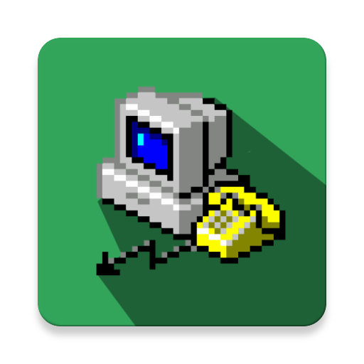

# DailUpFi

Plays dail up sound every time you connect to the Internets! 

Feel nostalgic for the 90's?

Ready for a throw back?

Ready for a sound blast from the past?

  

Just turn DailUpFi ON and every time you get connected to the Internets, you'll hear it - EVEN in the background. It's that 
annoying sound that we all love. 

**One might say it's a prank app!**

It started out as a playground for learning Kotlin, as you can see it's meaningless enough that I finally pushed it trough the finish line.

# License 

    The MIT License (MIT)

    Copyright (c) 2019 Viktor Arsovski
    
    Permission is hereby granted, free of charge, to any person obtaining a copy
    of this software and associated documentation files (the "Software"), to deal
    in the Software without restriction, including without limitation the rights
    to use, copy, modify, merge, publish, distribute, sublicense, and/or sell
    copies of the Software, and to permit persons to whom the Software is
    furnished to do so, subject to the following conditions:
    
    The above copyright notice and this permission notice shall be included in
    all copies or substantial portions of the Software.
    
    THE SOFTWARE IS PROVIDED "AS IS", WITHOUT WARRANTY OF ANY KIND, EXPRESS OR
    IMPLIED, INCLUDING BUT NOT LIMITED TO THE WARRANTIES OF MERCHANTABILITY,
    FITNESS FOR A PARTICULAR PURPOSE AND NONINFRINGEMENT. IN NO EVENT SHALL THE
    AUTHORS OR COPYRIGHT HOLDERS BE LIABLE FOR ANY CLAIM, DAMAGES OR OTHER
    LIABILITY, WHETHER IN AN ACTION OF CONTRACT, TORT OR OTHERWISE, ARISING FROM,
    OUT OF OR IN CONNECTION WITH THE SOFTWARE OR THE USE OR OTHER DEALINGS IN
    THE SOFTWARE.

TL:DR - you can use any part of the code.

